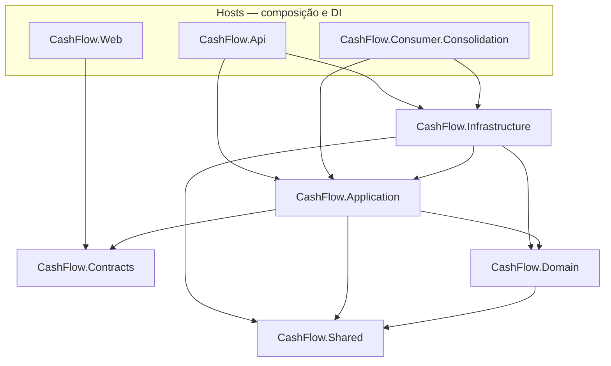

# ADR-003 – Arquitetura DDD em camadas

Data: 2026-06-13  
Status: Aprovado  
Responsáveis: Samuel Fabel

---

## Contexto

O domínio envolve lançamentos financeiros e consolidação diária. É necessário separar regras de negócio de detalhes de infraestrutura e facilitar testes.

---

## Decisão

Organizar a solução em camadas DDD:

| Projeto                   | Responsabilidade                                    |
| ------------------------- | --------------------------------------------------- |
| `CashFlow.Domain`         | Entidades, value objects, enums, eventos de domínio |
| `CashFlow.Contracts`      | DTOs HTTP (`*Request`, `*Response`)                 |
| `CashFlow.Application`    | Casos de uso, portas (interfaces), orquestração     |
| `CashFlow.Infrastructure` | Dapper, RabbitMQ, FluentMigrator                    |
| `CashFlow.Shared`         | Contratos de mensagens compartilhados               |
| APIs / Worker / Web       | Hosts e composição (DI)                             |

---

## Justificativa

1. Fronteiras explícitas facilitam evolução e testes unitários.
2. Agregados encapsulam invariantes (valor positivo, tipo crédito/débito).
3. Alinhamento com SOLID (DIP, SRP).

---

## Consequências Positivas

- Domínio testável sem banco ou fila
- Troca de adaptadores sem alterar casos de uso

---

## Consequências Negativas

- Mais projetos e boilerplate inicial
- Disciplina necessária para não vazar EF/SQL no domínio

---

## Alternativas Consideradas

1. **Monólito anêmico** — Rejeitado por concentrar regras em controllers.
2. **Microserviços completos desde o início** — Rejeitado por complexidade operacional prematura; separação lógica com deploy modular (API de lançamentos vs consumer de consolidado).
