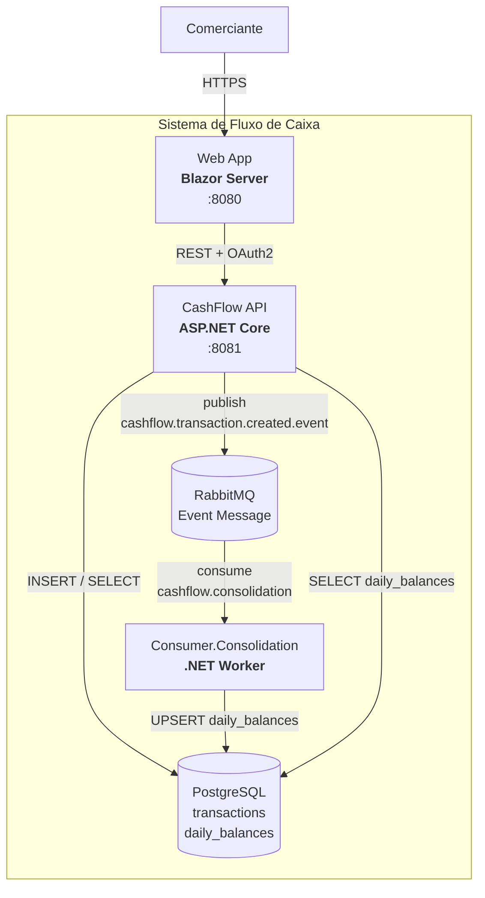

# C4 — Diagrama de Containers

Deploy units e integrações entre os componentes do sistema.

## Responsabilidades

| Container | Papel |
|-----------|-------|
| **Web App** | UI do comerciante; login OAuth; formulários de lançamento e consulta de saldo |
| **CashFlow API** | REST de lançamentos e saldos; emissão de tokens; publicação de eventos após persistência |
| **Consumer.Consolidation** | Projeção assíncrona do consolidado diário a partir dos eventos |
| **PostgreSQL** | Fonte de verdade dos lançamentos e projeção de saldos |
| **RabbitMQ** | Desacopla escrita de lançamentos da materialização do consolidado |

Definições detalhadas: [c4-definicoes-fluxo-caixa.md](../c4-definicoes-fluxo-caixa.md#nível-2-container-diagram---definições).
