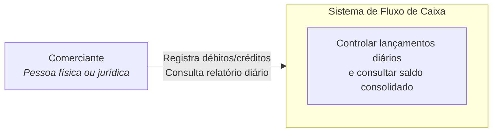

# C4 — Diagrama de Contexto

Visão de alto nível: quem usa o sistema e qual problema ele resolve.

## Elementos

| Elemento                      | Descrição                                                                         |
| ----------------------------- | --------------------------------------------------------------------------------- |
| **Comerciante**               | Usuário final que opera o caixa via interface web                                 |
| **Sistema de Fluxo de Caixa** | Plataforma que persiste lançamentos, publica eventos e materializa saldos diários |

Definições detalhadas: [c4-definicoes-fluxo-caixa.md](../c4-definicoes-fluxo-caixa.md#nível-1-context-diagram---definições).
