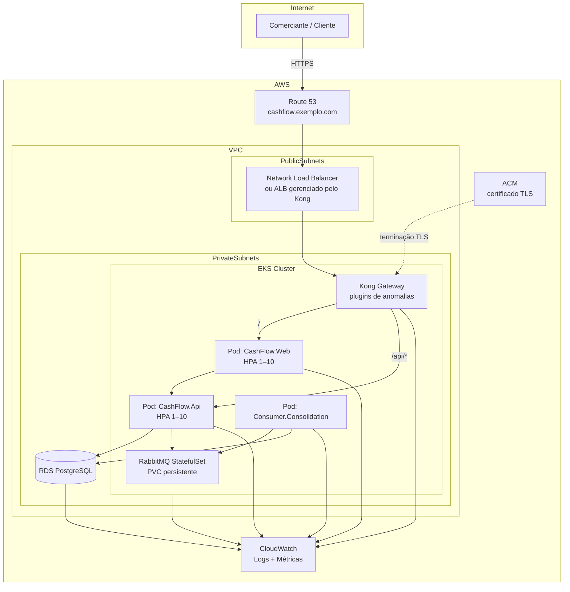

# Ambiente de implantação — AWS, Kubernetes e Terraform

## Autor

Samuel Fabel

## Objetivo

Este documento descreve o **ambiente alvo de produção** do Sistema de Fluxo de Caixa na **AWS**, com aplicações em **pods independentes** no **Kubernetes (EKS)**, provisionamento **integral via Terraform** e capacidade de **recriar o ambiente do zero** quando necessário.

> **Escopo:** documentação de arquitetura de infraestrutura. Não há implementação de Terraform, manifests ou pipelines neste repositório — o material serve como referência para evolução futura do projeto.

---

## Premissas

| Item                       | Decisão                                                                  |
| -------------------------- | ------------------------------------------------------------------------ |
| Nuvem                      | Amazon Web Services (AWS)                                                |
| Orquestração               | Amazon EKS                                                               |
| Banco relacional           | Amazon RDS for PostgreSQL                                                |
| Mensageria                 | RabbitMQ em pod com estado no cluster                                    |
| Entrada HTTP(S)            | Kong Gateway (Ingress/API Gateway no cluster)                            |
| DNS público                | Amazon Route 53                                                          |
| Certificado TLS            | AWS Certificate Manager (ACM)                                            |
| Observabilidade            | Amazon CloudWatch (logs e métricas)                                      |
| Infraestrutura como código | Terraform (módulos para rede, EKS, RDS, IAM, DNS, ACM, observabilidade)  |
| Recriação                  | `terraform destroy` + `terraform apply` reprovisiona o ambiente completo |

---

## Visão geral



### Roteamento no gateway

Um **único domínio público** (ex.: `https://cashflow.exemplo.com`) aponta para o Kong:

| Caminho | Destino        | Descrição                                                                                              |
| ------- | -------------- | ------------------------------------------------------------------------------------------------------ |
| `/`     | `CashFlow.Web` | Interface Blazor Server                                                                                |
| `/api`  | `CashFlow.Api` | API REST, OAuth e OpenID (`/api/...`, `/oauth/...`, `/.well-known/...` conforme mapeamento no Ingress) |

O Kong atua como **ponto único de entrada**, aplicando TLS (certificado ACM), políticas de roteamento e plugins de segurança antes do tráfego chegar aos pods.

---

## Componentes por camada

### Rede e fundação (Terraform)

- **VPC** com sub-redes públicas (load balancer / NAT) e privadas (EKS, RDS).
- **Security groups** restritivos: RDS acessível apenas pelos pods da aplicação; RabbitMQ apenas dentro do cluster; Kong exposto na borda.
- **NAT Gateway** para saída dos pods privados (pull de imagens, integrações externas).
- **IAM roles** para nodes EKS, IRSA (IAM Roles for Service Accounts) para workloads acessarem CloudWatch e outros serviços AWS sem credenciais estáticas.

### Amazon EKS

Cluster Kubernetes gerenciado onde rodam todos os workloads da aplicação:

| Workload                            | Tipo                        | Réplicas                         | Escalonamento                                              |
| ----------------------------------- | --------------------------- | -------------------------------- | ---------------------------------------------------------- |
| **CashFlow.Api**                    | Deployment                  | mín. 1                           | HPA até **10** pods (CPU/memória ou métricas customizadas) |
| **CashFlow.Web**                    | Deployment                  | mín. 1                           | HPA até **10** pods                                        |
| **CashFlow.Consumer.Consolidation** | Deployment                  | conforme fila                    | HPA opcional por lag de consumo                            |
| **Kong**                            | Deployment ou chart oficial | ≥ 2 (HA)                         | Fixo ou HPA leve                                           |
| **RabbitMQ**                        | **StatefulSet**             | 1 (ou cluster 3 nós em evolução) | Disco persistente                                          |

**Pods independentes:** cada serviço possui Deployment/StatefulSet, Service e configurações próprias. Falha ou reinício de um pod não derruba os demais — alinhado ao requisito de que o serviço de lançamentos permaneça disponível mesmo com instabilidade no consolidado.

### Amazon RDS (PostgreSQL)

- Instância **RDS PostgreSQL** em sub-rede privada.
- Multi-AZ recomendado para produção.
- Backups automáticos e snapshots para recuperação.
- Credenciais em **AWS Secrets Manager** (referenciadas pelos pods via CSI ou variáveis injetadas pelo Terraform/External Secrets).
- Mesmo modelo lógico do ambiente local: `transactions`, `daily_balances`, usuários e autenticação.

### RabbitMQ no Kubernetes

- Implantado como **StatefulSet** com **PersistentVolumeClaim (PVC)** por réplica.
- Fila e exchanges sobem com o broker; **mensagens persistem em disco**.
- Se o pod cair e reiniciar, o volume é reanexado e as mensagens **não são perdidas** (filas duráveis + mensagens persistentes, conforme ADR-004).
- Service headless para identidade estável do pod (`rabbitmq-0`, etc.).

### Kong Gateway

- Instalado no cluster (ex.: Kong Ingress Controller ou Kong Gateway Operator).
- **Roteamento por path** para Web (`/`) e API (`/api`).
- **Plugins** habilitados para **detecção de anomalias**, por exemplo:
  - rate limiting e request size limiting;
  - bot detection / IP restriction quando aplicável;
  - integração com soluções de WAF/anomaly (ex.: plugin de machine learning ou exportação de métricas para alarmes no CloudWatch).
- Terminação TLS com certificado **ACM** (via ACM no ALB/NLB ou integração Kong + certificado importado/CSI).

### Route 53 e ACM

- **Route 53:** zona hospedada para o domínio da aplicação; registro **A/AAAA alias** apontando para o load balancer na frente do Kong.
- **ACM:** emissão e renovação automática do certificado HTTPS para o domínio (e SANs, se necessário). O certificado é associado ao balanceador ou ao Ingress que o Kong utiliza.

### Observabilidade — CloudWatch

| Sinal        | Origem                                                  | Uso                                                                     |
| ------------ | ------------------------------------------------------- | ----------------------------------------------------------------------- |
| **Logs**     | API, Web, Consumer, Kong, sidecars                      | `awslogs` / Fluent Bit → CloudWatch Logs; grupos por serviço e ambiente |
| **Métricas** | Pods (cAdvisor/kubelet), HPA, RDS, ALB, filas           | CloudWatch Metrics + dashboards                                         |
| **Alarmes**  | Latência, erros 5xx, CPU, conexões RDS, lag do consumer | SNS / integração com canal de incidentes                                |

Métricas de negócio (ex.: taxa de publicação de `TransactionCreatedMessage`, tempo de projeção do consolidado) podem ser exportadas via **OpenTelemetry** ou biblioteca .NET para CloudWatch Embedded Metric Format (EMF).

---

## Infraestrutura como código (Terraform)

O ambiente deve ser provisionado **do zero** com Terraform, organizado em módulos reutilizáveis:

```bash
terraform/
├── environments/
│   ├── dev/
│   ├── staging/
│   └── prod/
└── modules/
    ├── network/          # VPC, subnets, NAT, SGs
    ├── eks/              # cluster, node groups, add-ons
    ├── rds/              # PostgreSQL
    ├── route53/          # zona e registros
    ├── acm/              # certificados
    ├── observability/    # log groups, alarms, dashboards
    └── iam/              # roles IRSA, políticas
```

**Fluxo de recriação:**

1. `terraform plan` — revisão das mudanças.
2. `terraform apply` — cria ou atualiza recursos AWS.
3. Deploy dos manifests Kubernetes (Helm/Kustomize) referenciando endpoints do Terraform (RDS endpoint, URLs, ARNs).
4. Em desastre ou drift: `terraform destroy` (com cautela em produção) seguido de novo `apply` restaura a base; dados críticos dependem de **snapshots RDS** e **backups de volume RabbitMQ**.

**Estado:** backend remoto (ex.: S3 + DynamoDB lock) para estado compartilhado e reprodutível entre operadores e pipelines.

---

## Escalonamento e disponibilidade

### API e Web (HPA 1 → 10)

- **Mínimo:** 1 réplica cada — garante disponibilidade contínua com custo reduzido em baixa carga.
- **Máximo:** 10 réplicas — atende picos (ex.: RNF de até 50 req/s no consolidado com margem).
- Métricas sugeridas: CPU média 70%, memória, ou requisições por segundo via métricas customizadas do Kong/ALB.

### Consumer

- Escala conforme profundidade da fila `cashflow.consolidation` (KEDA ou HPA com métrica RabbitMQ).
- Independente da API: fila absorve picos de escrita enquanto o consolidado processa de forma assíncrona.

### Kong e RabbitMQ

- Kong: pelo menos 2 réplicas para evitar SPOF na borda.
- RabbitMQ: StatefulSet com disco; em evolução, cluster de 3 nós com quorum queues.

---

## Segurança (resumo)

- Tráfego externo apenas **HTTPS** (ACM).
- Pods em sub-redes privadas; sem IP público nos workloads de aplicação.
- Secrets fora do Git (Secrets Manager / Sealed Secrets).
- IAM least privilege e IRSA por serviço.
- Kong como camada de inspeção e detecção de anomalias na borda.

---

## Correspondência com o ambiente local

| Local (Docker Compose)            | Produção (AWS)                                    |
| --------------------------------- | ------------------------------------------------- |
| `CashFlow.Api` :8081              | Deployment `cashflow-api` atrás do Kong em `/api` |
| `CashFlow.Web` :8080              | Deployment `cashflow-web` atrás do Kong em `/`    |
| `CashFlow.Consumer.Consolidation` | Deployment `cashflow-consumer`                    |
| PostgreSQL container              | RDS PostgreSQL                                    |
| RabbitMQ container                | StatefulSet RabbitMQ + PVC                        |
| —                                 | Kong, Route 53, ACM, CloudWatch, Terraform        |

O desenvolvimento local continua válido para iteração rápida ([ADR-008](adr/ADR-008-docker-compose.md)); este documento define o **alvo de implantação** em nuvem.

---

## Referências

- [Definições C4 — Fluxo de Caixa](c4-definicoes-fluxo-caixa.md)
- [ADR-001 — PostgreSQL](adr/ADR-001-persistencia-postgresql.md)
- [ADR-004 — RabbitMQ](adr/ADR-004-integracao-assincrona-rabbitmq.md)
- [ADR-008 — Docker Compose (dev)](adr/ADR-008-docker-compose.md)
- [ADR-014 — CI GitHub Actions](adr/ADR-014-ci-github-actions.md)
